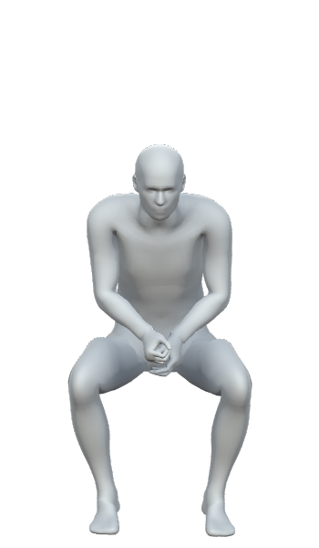
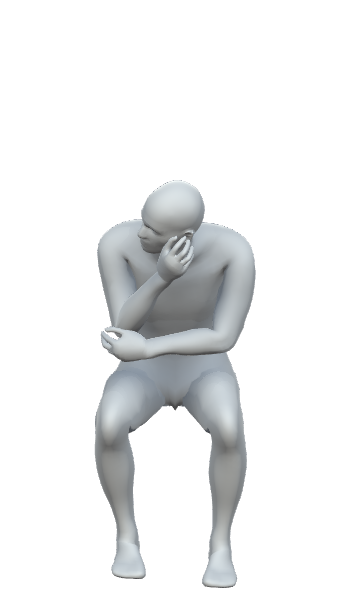
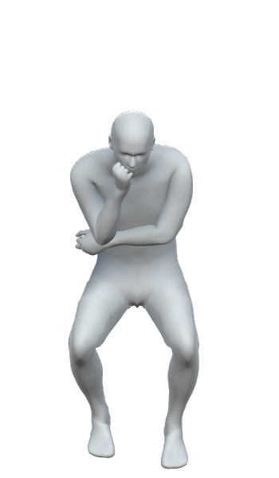
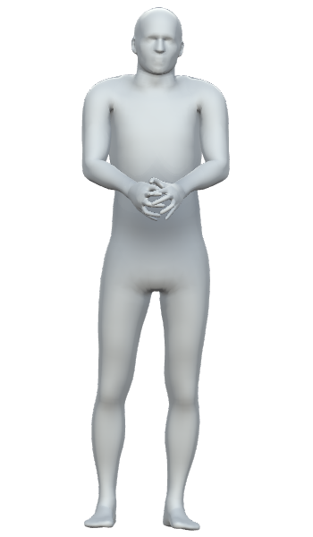
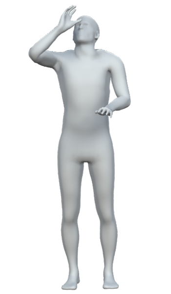
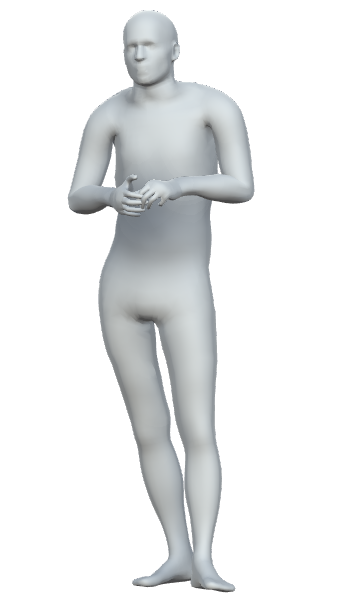
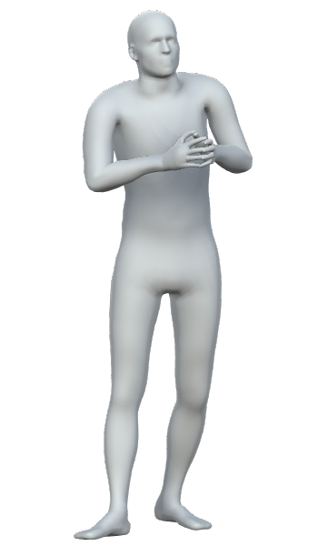
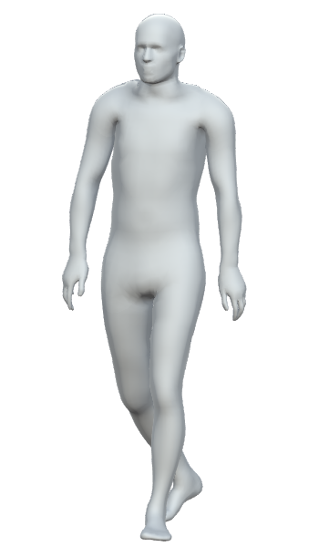
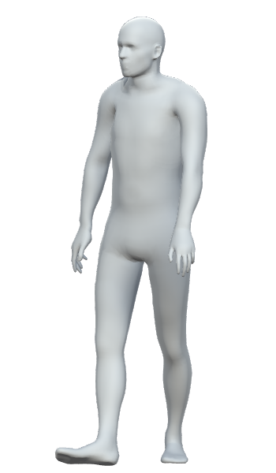

## UNOC

### Usage

Please download the [UNOC dataset](https://cloud.tugraz.at/index.php/s/ykqxA7HxYMnwbXr) and extract the BVH files.

Install Python and Pytorch. Please follow the Pytorch installation instructions from their [website](https://pytorch.org/get-started/locally/).

Install dependencies by running `pip install -r requirements.txt`

Before running any scripts, please set the environment variables

- _PATH_UNOC_ to the root directory of the UNOC dataset (containing the 13 participants).
- _PATH_DATA_ to a directory that can be used for temporary data, such as preprocessed feature sets and model weights.

#### Training

Once the environment variables are set, you can run the training script _train.py_. At first start, this will process the bvh files and save the pose
information as numpy files in _UNOC_PATH_. After the conversion is done, the feature sets for input and output are created and saved to _PATH_DATA_ to speed up
training. The training procedure will start once all feature sets are converted and should finish after a few minutes.

_train.py_ can be run in two modes:

- Predicting the fully body pose from incomplete tracking information `python train.py body`
- Predicting finger pose from body pose `python train.py finger`

#### Evaluation

Like _train.py_, _eval.py_ can be run in two modes:

- Predicting the fully body pose from incomplete tracking information `python eval.py body`
- Predicting finger pose from body pose `python eval.py finger`

Both modes support _plot_ as an additional argument that will animate the predicted animations using an interactive 3D view.

### Dataset

The dataset is available in different file formats and at different stages of processing:

- [Solved and calibrated body and hand pose (BVH)](https://cloud.tugraz.at/index.php/s/ykqxA7HxYMnwbXr): This data is used for training and evaluating the
  neural network.
- [Solved body without hand motion (FBX)](https://cloud.tugraz.at/index.php/s/NjdGBey6zaiayAb)
- [Solved hand motion (BVH)](https://cloud.tugraz.at/index.php/s/x4aorYcgtXoCLSL): Beware that the wrist rotation is not accurate and only the finger joint.
  motion is used in the merged animation.
- [Cleaned body markers](https://cloud.tugraz.at/index.php/s/q7KQ5gkkeP5QGoS): We used
  the [Optitrack Biomech 57](https://v22.wiki.optitrack.com/index.php?title=Biomech_(57)) markerset.